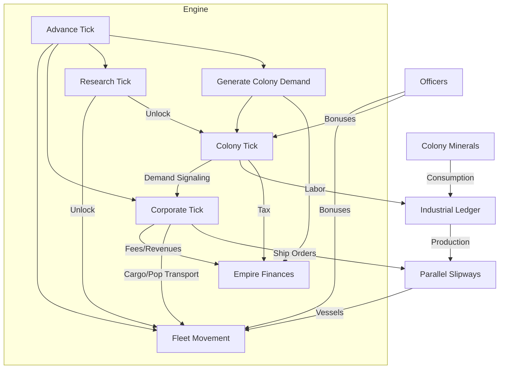

# Nebula4X: Comprehensive Game Feature Audit

This document provides a deep-dive audit of all current game systems, evaluating their connectivity, maturity, and visibility.

## 1. Feature Inventory & Maturity

| System | Status | Connectivity | Visibility (UI/Debug) |
| :--- | :--- | :--- | :--- |
| **Galaxy Generation** | Mature | High (Sets up all bodies/resources) | Good (System Map, Sidebar) |
| **Colony Simulation** | Active | High (Uses labor, generates minerals) | Excellent (Industrial Ledger) |
| **Research & Tech** | Active | Medium (Unlocks building types/bonuses) | Good (Research Tree) |
| **Empire Finances** | Active | High (Collects taxes, pays maintenance) | Excellent (Budget Breakdown) |
| **Naval Industry** | Refactored| High (Parallel slipways, tonnage limits) | Excellent (Shipyard Tab) |
| **Corporate Sector** | Mature | High (Responds to shortages, builds ships, bids on tenders) | Excellent (HQ + Logistics Monitor) |
| **Leadership (Officers)**| Active | Medium (Adds bonuses to Colonies/Fleets)| Fair (Officer Roster) |
| **Logistics (Trade)** | Mature | High (Physical movement, Demand-driven) | Excellent (Logistics Monitor) |
| **Ship Engineering** | Mature | High (Feeds Shipyards/Corp Orders) | Excellent (Naval Design Tab) |
| **Colonization** | Refactored| High (Physical migration, Colonization Kits) | Excellent (Colony Manager) |
| **Aetheric Stealth** | Proposed | Low (Flux metric exists, no logic yet) | N/A (Debug Overlay ready) |
| **Maintenance & Wear** | Proposed | Medium (Uses Mineral Stockpiles) | N/A (Health Audit ready) |
| **AI Infrastructure** | Mature | High (States, Diffing, Programmatic API) | Excellent (nebulaAPI + Scenarios Tab) |

---

## 2. System Connectivity Map (Current)

---

## 3. Gap Analysis & Expansion Opportunities

### A. The "Logistics" Gap (Closed & Refined)
- **Status**: Transitioned from abstract "pools" to strictly physical, freighter-based movement. 
- **Physical Migration**: Population now only moves via ships equipped with `ColonizationModule`. Colonies track `migrantsWaiting` as a physical cargo type.
- **Dynamic Demand**: The "trade spark" is now driven by `generateColonyResourceDemand`. Every building in the production queue and every ship in the shipyard generates a physical "pull" for minerals (Iron, Copper, etc.).
- **Survival Reserves**: Outposts demand Food and Fuel reserves, ensuring sustainable frontier growth.

### B. Corporate-Government Interaction (Mature)
- **Current**: Corporations respond to player shortages, fund shipyards, and expand across the empire.
- **Empire-Wide Expansion**: Corporations now evaluate all colonies for expansion opportunities. Mining companies prioritize mineral accessibility, while Agricultural companies seek habitability and population.
- **Logistics Loops**: Transport companies commission freighters and colony ships based on real empire-wide signals, closing the loop between state policy (Marking a colony) and private execution (Moving people and materials).
- **Visibility**: Completed "Colonial Investment Audit" tracking wealth/facilities over time.

### C. Combat & Military (High Priority)
- **Current**: Ground defenses exist, but combat logic is skeletal. Defensive components (armor/shields) have stats but no function.
- **Expansion**: Implement a dedicated Combat Engine for ship-to-ship and fleet-to-colony engagements.
- **Testing Needs**: A "Battle Simulator" in the Debug Console to spawn two opposing fleets and resolve a fight.

### D. Ship Design & Customization (Completed)
- **Status**: Transitioned from hardcoded templates to a fully modular "Naval Engineering" bureau. 
- **Features**: Drag-and-drop component fitting, real-time Aetheric Flux (power) audit, tonnage utilization bar, and mineral cost breakdown.

### E. Species & Habitability
- **Current**: Habitability impacts growth and happiness.
- **Expansion**: Multiple species with different atmosphere requirements (Oxygen vs. Methane).
- **Visibility**: A "Species Overview" tab in the Empire view.

### F. Deep Corporate Integration (Distant Worlds Inspired)
- **Tenders & Licenses**: [IMPLEMENTED] The State (Player) auctions "Mining Rights". 
- **Private Subsidies**: [IMPLEMENTED] Player can fund corporate fleet construction (Modernization Grants).
- **Stock Market**: [IMPLEMENTED] "Corporate Exchange" with assets, transport volume, and profitability ledgers.

### G. Aetheric Signature & Detection (Aurora 4X Inspired)
- **Signal Strength**: A ship's "Aetheric Flux" (Power Output) creates a signature.
- **Passive vs Active**: Passive sensors vs Active "Aether-Pings".
- **Stealth Hulls**: New tech to reduce Aetheric Signature at the cost of tonnage.

---

## 4. Geopolitical & AI Empire Framework (New Phase)

The objective is to transition from a single-player sandbox to a competitive galactic stage featuring fully autonomous, AI-driven empires.

### A. Strategic AI Layer
- **Goal-Oriented Decision Making**: AI empires should prioritize Expansion, Consolidation, or Aggression based on their current strengths and species traits.
- **Economic Intelligence**: AI empires will manage their own colonies, finances, and corporate sectors similarly to the player.

### B. Diplomatic Framework
- **Treaty System**: Non-aggression pacts, trade agreements, and research alliances.
- **Border Sovereignty**: Claims over systems and jump point control. Transiting through foreign space without permission increases tension.
- **Inter-Empire Trade**: A physical trade network where freighters move resources between different empire-controlled systems.

### C. Escalating Tension & Casus Belli
- **Tension Metric**: Tracks historical interactions. High tension leads to "Formal Warnings" and eventually war.
- **Espionage**: Covert operations to steal tech, sabotage shipyards, or incite colonial unrest.

---

## 5. Summary of Audit Findings

**Priority #1 (State Actors):** Implementing the AI Empire Framework to provide rivals and partners.
**Priority #2 (Logistics & Stealth):** Implementing "Aetheric Detection" and ship maintenance.
**Priority #3 (Combat Engine):** Ship-to-ship resolution and the Battle Simulator.
